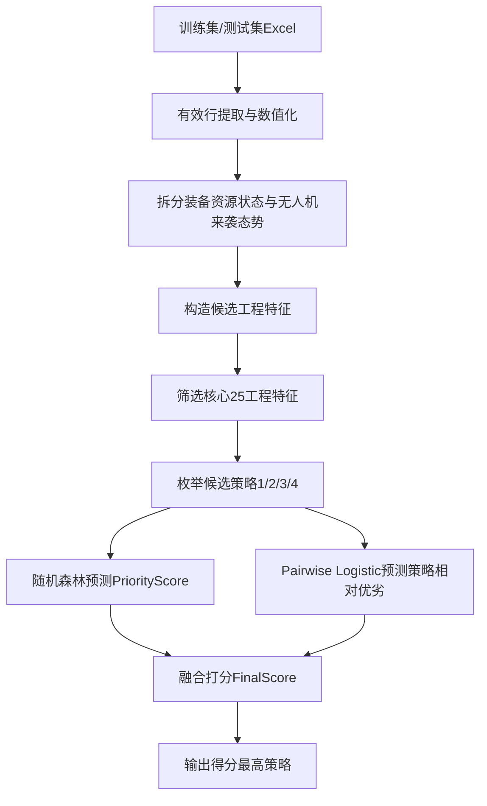

# 拦截率优先的核心特征 Pairwise 纠偏策略推荐算法研究

## 摘要

针对多样化无人机来袭态势和复杂装备资源条件下体系运用策略难以高效选择的问题，本文将反无人机策略生成任务建模为完整场景下的离散策略收益评估问题。与直接预测历史策略类别不同，本文围绕“给定装备资源状态和六组无人机同步来袭态势，如何从策略1至策略4中选择拦截率优先且效费比较优的策略”展开建模。首先，对原始 Excel 数据进行有效行提取、数值化、特征结构拆分和指标方向统一，将原始 42 个输入字段划分为 18 个装备资源状态字段和 24 个来袭态势字段。其次，根据反无人机任务机理构造 59 个候选工程特征，覆盖态势威胁、装备能力、攻防匹配压力和装备能力结构四类信息；进一步通过消融实验筛选出 25 个核心工程特征，使最终输入维度由 101 维压缩至 67 维。再次，针对指标一平均拦截率优先、指标二平均效费比次级优化的要求，构造拦截率优先得分，并采用“随机森林收益预测 + Pairwise 相对偏好纠偏”的模型结构对四个候选策略进行统一泛化评分。实验结果表明，所提出的核心特征 Pairwise 纠偏模型在分组交叉验证下取得 top1 match 0.5591、top2 hit 0.8065、soft match 0.6889、mean regret 0.0370 和 Pareto hit 0.6882。与直接分类、单点效用回归、聚类自适应、Pareto 筛选和多模型投票等方法相比，该方法在保持统一泛化流程的同时，更好地兼顾了拦截率优先约束、策略相对优劣建模和冗余特征控制。

**关键词：** 反无人机；策略推荐；拦截率优先；特征工程；Pairwise 排序；随机森林；双目标优化

## 1 引言

随着无人机集群化、低空化和多方向来袭特征日益突出，反无人机作战中的体系资源运用策略选择面临更高的不确定性。一方面，来袭态势由多组目标同时构成，距离、角度、速度和数量共同影响威胁强度；另一方面，防御体系中的多类装备资源具有不同性能指标和起效状态，资源能力并非简单由“是否起效”决定。如何在给定来袭态势和装备资源状态下快速选择合适的体系策略，直接影响平均拦截率和平均效费比。

本任务提供了千规模仿真训练数据和百规模测试数据。训练集中每条样本包含完整场景输入、离散策略编号以及两个结果指标。早期直观做法可能将“使用策略”视作分类标签，训练分类器直接预测策略类别。然而，数据分析显示，同一完整场景下可能存在多个策略及其不同指标结果，历史使用策略并不等价于最优策略。因此，本任务的核心不是复现历史策略，而是学习不同候选策略在当前完整场景下的收益差异，并据此进行策略排序。

本文围绕这一任务特性提出纯模型泛化版策略推荐算法。该算法不依赖“测试场景在训练集中出现过则直接查表”的特殊逻辑，而是对全部测试样本采用一致的模型推断流程。具体而言，本文首先构造符合任务机理的工程特征，并通过消融实验筛选核心特征；随后使用拦截率优先得分统一两个指标的决策顺序；最后将随机森林的非线性收益预测能力与 Pairwise Logistic 的策略相对偏好学习能力结合，以缓解单点回归模型对某些策略的过推荐偏差。

本文的主要贡献包括三点。第一，提出适用于该任务的拦截率优先收益建模方式，避免简单等权指标合成导致目标偏移。第二，构造并筛选出一组覆盖态势威胁、装备能力、攻防压力和装备结构的核心工程特征，在减少冗余特征的同时提高泛化效果。第三，引入 Pairwise 策略纠偏机制，显式学习同一完整场景下策略对之间的相对优劣，从而提升策略排序的稳健性。

## 2 问题定义

### 2.1 样本粒度

本文将一个样本定义为一次完整防御场景，而不是单个无人机目标或单个装备单元。每个场景包含 6 组装备资源状态和 6 组无人机群同步来袭态势。

装备资源状态包括：

- 6 组装备的性能指标1；
- 6 组装备的性能指标2；
- 6 组装备是否起效。

无人机来袭态势包括：

- 6 组无人机群距离；
- 6 组无人机群角度；
- 6 组无人机群速度；
- 6 组无人机群数量。

因此，原始输入共 42 个字段：

| 组成部分 | 结构 | 字段数 |
|---|---|---:|
| 装备资源状态 | 6组装备 × 3字段 | 18 |
| 无人机来袭态势 | 6组无人机群 × 4字段 | 24 |
| 完整场景输入 | 装备状态 + 来袭态势 | 42 |

### 2.2 策略与目标

策略集合为离散集合：

`S = {1, 2, 3, 4}`

对每个测试样本，算法需要从四个策略中推荐一个策略。训练样本给定两个结果指标：

- `M1`：平均拦截率；
- `M2`：平均效费比。

两者均为越大越好，但决策优先级不同。当前任务要求为：优先提高平均拦截率，在拦截率优先条件下再考虑平均效费比。因此，本文不采用简单 5:5 等权收益作为最终目标，而是构造拦截率优先得分：

`PriorityScore = norm(M1) + 0.05 * norm(M2)`

其中 `norm(.)` 表示在训练集指标范围内归一化。`0.05` 表示效费比仅作为次级修正项，只有在拦截率接近时才明显改变策略排序。

### 2.3 建模形式

本文将任务转化为候选策略收益评估问题。对任意场景 `x` 和候选策略 `s`，学习函数：

`f(x, s) -> PriorityScore`

测试时枚举四个策略：

`f(x, 1), f(x, 2), f(x, 3), f(x, 4)`

最终推荐：

`s* = argmax_s f(x, s)`

该建模形式比直接分类更符合任务本质，因为它比较的是同一完整场景下不同策略的收益差异，而不是复现训练集中历史策略编号。

## 3 数据预处理

### 3.1 有效样本提取

原始训练集和测试集均为 Excel 文件。表格前两行包含说明或表头信息，不作为模型训练样本。预处理时跳过前两行，将后续记录转换为有效数值样本。

处理后数据规模为：

| 数据集 | 样本数 |
|---|---:|
| 训练集 | 936 |
| 测试集 | 104 |

### 3.2 数值化与字段拆分

对全部字段进行数值化转换，包括输入特征、策略编号和结果指标。随后根据题目字段结构将原始输入拆分为两组：

- 前 18 个字段作为装备资源状态；
- 后 24 个字段作为无人机来袭态势。

该拆分不是形式处理，而是后续特征工程和模型解释的基础。例如，装备资源状态用于计算装备能力、能力差异、能力熵等特征；无人机态势用于计算威胁强度、威胁集中度和角度跨度等特征。

### 3.3 完整场景 Key 构造

训练集中存在同一完整场景对应多个策略结果的情况。本文使用原始 42 个输入字段构造完整场景 Key，用于：

1. 分析同一场景下不同策略的收益差异；
2. 构造 Pairwise 策略对训练样本；
3. 在交叉验证时进行场景分组切分，避免同一场景泄漏到训练折和验证折。

需要强调的是，完整场景 Key 不用于最终测试集查表决策。最终算法对所有测试样本均采用模型泛化推荐。

## 4 特征工程与筛选

### 4.1 候选工程特征构造

原始 42 个字段虽然完整保留了场景信息，但缺少任务机理层面的聚合表达。为提高模型对威胁强度、装备能力和攻防匹配关系的识别能力，本文构造 59 个候选工程特征。

#### 态势威胁特征

对第 `i` 组无人机群，定义威胁强度：

`Threat_i = 数量_i * 速度_i / 距离_i`

在此基础上构造：

- 目标总数；
- 有目标群数量；
- 总威胁；
- 最大威胁；
- 平均威胁；
- 威胁标准差；
- 威胁集中度；
- 威胁加权平均角度；
- 角度跨度；
- 各无人机群威胁强度。

这些特征用于表征一次六组无人机同步来袭的整体强度和空间分布。

#### 装备能力特征

装备并非同质资源。每组装备具有不同的性能指标1、性能指标2和起效状态。定义有效装备能力：

`Capability_i = (性能指标1_i + 性能指标2_i) * 是否起效_i`

进一步构造：

- 装备总能力；
- 性能指标1有效能力；
- 性能指标2有效能力；
- 有效装备数量；
- 失效装备数量；
- 最强单装备能力；
- 最弱有效装备能力；
- 装备能力均衡度。

这些特征用于描述资源总量和单装备能力差异。

#### 攻防匹配压力特征

仅有威胁或能力并不足以判断策略优劣。关键在于当前威胁与装备能力之间是否匹配。因此构造：

- 总威胁 / 总装备能力；
- 目标数量 / 有效装备数量；
- 装备能力 / 目标数量；
- 最大威胁 / 最强装备能力；
- 各装备类型承压指标。

这些特征用于表达当前场景下防御体系承受的压力。

#### 装备结构特征

为刻画不同装备类型之间的能力分布，按每两组装备聚合为一个装备类型，构造：

- 三类装备能力；
- 三类装备起效数量；
- 三类装备性能1/性能2能力；
- 类型能力差；
- 类型能力标准差；
- 类型最小能力；
- 能力熵；
- 性能1/性能2比例。

这些特征用于描述资源能力是否集中、是否均衡以及是否存在结构性短板。

### 4.2 特征筛选实验

由于训练集规模为 936 条，而候选工程特征为 59 个，若全部使用会将输入维度扩展至 101 维，存在冗余和过拟合风险。因此，本文没有采用“特征越多越好”的策略，也没有直接使用单变量相关性或模型重要性进行黑盒筛选，而是采用“机理分组构造、特征组消融验证、多指标综合选择”的筛选方法。

具体筛选逻辑如下。

1. 先按任务机理划分候选特征族。59 个候选工程特征被划分为态势威胁、装备资源、攻防匹配、装备结构和局部群组威胁等类别。这样做的目的是保证特征选择不是纯统计过程，而是围绕“无人机来袭强度、装备可用能力、威胁与资源是否匹配、装备结构是否存在短板”四个核心问题展开。

2. 再构造若干可解释特征组。本文不是逐个特征贪心加入，而是构造 `threat9`、`resource12`、`match10`、`compact15`、`core25` 和 `all59` 等特征组。每个特征组对应一种建模假设：例如 `threat9` 检验仅增强态势信息是否有效，`resource12` 检验仅增强装备状态是否有效，`match10` 检验攻防压力类特征是否关键，`all59` 检验全量特征是否带来收益，`core25` 则保留各机理类别中最稳定、最有解释力的特征。

3. 使用同一模型和同一验证协议做消融比较。所有特征组均采用相同的分组交叉验证和相同的 Pairwise 纠偏推荐模型，避免由于模型变化导致比较不公平。这样，指标差异主要来自特征组本身。

4. 按多指标综合选择，而不是只看单一 top1。本文同时关注 top1、top2、soft match、regret 和 Pareto hit。其中 top1 表示命中最优策略能力，soft match 表示推荐策略接近最优的程度，regret 表示收益损失，Pareto hit 表示双指标合理性。最终选择 `core25`，是因为它在 top1、soft match 和 Pareto hit 上同时最优，虽然 raw42 的 top2 较高，但 soft match 和 Pareto hit 较低，说明其推荐稳定性和多目标合理性不足。

5. 控制冗余和噪声。`all59` 包含更多细粒度特征，如每组无人机威胁、部分二值起效模式和重复能力统计，但这些特征在小样本条件下可能引入噪声。`core25` 则保留总量、最大值、离散度、压力比和类型结构等稳定聚合特征，剔除过细或信息重复的变量。

实验对比特征集包括：

| 特征集 | 含义 |
|---|---|
| raw42 | 仅使用原始 42 特征 |
| raw42_plus_threat9 | 原始特征 + 9 个态势威胁特征 |
| raw42_plus_resource12 | 原始特征 + 12 个装备资源特征 |
| raw42_plus_match10 | 原始特征 + 10 个攻防匹配特征 |
| raw42_plus_compact15 | 原始特征 + 15 个紧凑工程特征 |
| raw42_plus_core25 | 原始特征 + 25 个核心工程特征 |
| raw42_plus_all59 | 原始特征 + 全部 59 个工程特征 |

结果如下：

| 特征集 | 总特征数 | top1 | top2 | soft match | regret | Pareto hit |
|---|---:|---:|---:|---:|---:|---:|
| raw42_plus_core25 | 67 | 0.5591 | 0.8065 | 0.6889 | 0.0370 | 0.6882 |
| raw42_plus_match10 | 52 | 0.5376 | 0.8065 | 0.6748 | 0.0369 | 0.6613 |
| raw42_plus_all59 | 101 | 0.5215 | 0.8118 | 0.6705 | 0.0403 | 0.6613 |
| raw42_plus_compact15 | 57 | 0.5376 | 0.7957 | 0.6628 | 0.0361 | 0.6505 |
| raw42_plus_resource12 | 54 | 0.5376 | 0.8065 | 0.6614 | 0.0349 | 0.6613 |
| raw42_plus_threat9 | 51 | 0.5215 | 0.7903 | 0.6548 | 0.0363 | 0.6720 |
| raw42 | 42 | 0.5108 | 0.8226 | 0.6523 | 0.0368 | 0.6559 |

结果显示，核心25工程特征在 top1、soft match 和 Pareto hit 上均优于全部59工程特征。这说明并非工程特征越多越好，部分候选特征存在冗余或噪声，会干扰模型泛化。最终模型采用原始42特征加核心25工程特征，共67维输入。

## 5 方法

### 5.1 方法概述

本文提出的最终算法为“拦截率优先的核心特征 Pairwise 纠偏策略推荐算法”。该方法不直接预测策略类别，而是对同一完整场景下的四个候选策略分别计算收益得分，并选择得分最高的策略。方法由五个连续模块组成：

1. 场景结构化表示：将原始输入拆分为装备资源状态和无人机来袭态势；
2. 核心工程特征构造：在原始42维输入基础上加入筛选后的25个机理特征；
3. 拦截率优先目标构造：将平均拦截率作为主目标，将平均效费比作为次级修正目标；
4. 候选策略收益预测：使用随机森林估计每个候选策略的拦截率优先收益；
5. Pairwise 策略纠偏：通过同场景策略对偏好学习修正单点收益预测的策略偏置。

整体流程如下：

该流程的核心思想是将“策略推荐”转化为“候选策略排序”。对于每个测试场景，算法并不直接输出一个策略标签，而是构造四个候选样本：

`(x, 1), (x, 2), (x, 3), (x, 4)`

其中 `x` 表示完整场景特征，`1/2/3/4` 表示候选策略。模型分别计算四个候选策略的最终得分：

`FinalScore_1, FinalScore_2, FinalScore_3, FinalScore_4`

最终选择：

`s* = argmax_s FinalScore_s`

### 5.2 场景表示与输入编码

设原始完整场景输入为：

`x_raw in R^42`

其中前18维为装备资源状态，后24维为无人机来袭态势。经过特征筛选后，保留25个核心工程特征：

`x_eng in R^25`

最终场景表示为：

`x = [x_raw, x_eng] in R^67`

为了让模型区分同一场景下的不同候选策略，需要将策略编号编码后与场景特征拼接。本文采用两种策略编码同时输入模型：

1. 策略编号数值编码：`s in {1,2,3,4}`；
2. 策略 one-hot 编码：`onehot(s) in R^4`。

因此，随机森林收益预测模型的实际输入为：

`z_s = [x, s, onehot(s)]`

该设计保留了策略编号的离散含义，同时避免模型仅把策略当作连续数值变量处理。

### 5.3 拦截率优先目标构造

训练集中每条样本包含两个结果指标：平均拦截率 `M1` 和平均效费比 `M2`。由于两者量纲和数值范围不同，先在训练集上分别进行 min-max 归一化：

`m1 = (M1 - min(M1)) / (max(M1) - min(M1))`

`m2 = (M2 - min(M2)) / (max(M2) - min(M2))`

根据“指标一优先、指标二次级”的要求，构造监督学习目标：

`U = m1 + beta * m2`

其中：

`beta = 0.05`

因此，模型训练目标不是简单的历史策略类别，也不是两个指标等权平均，而是拦截率优先收益 `U`。该目标有两个作用：一是保证平均拦截率在策略排序中占主导地位；二是在拦截率接近时允许平均效费比参与细粒度比较。

其中 `beta=0.05` 不是按评委两个指标等权得到的，而是根据“指标一优先、指标二次级”的任务约束设定。由于 `M1` 和 `M2` 均已归一化到 `[0,1]`，`0.05` 的含义是：只有当两个策略的拦截率归一化差异较小，例如低于约 `0.05` 时，效费比差异才可能改变排序；若两个策略拦截率差距较大，则效费比不会推翻拦截率优先原则。因此，该权重体现的是目标优先级，而不是单纯追求验证集最高 match 的经验调参。

### 5.4 随机森林收益预测模块

随机森林模型用于学习完整场景与候选策略之间的非线性收益关系。对训练集中的每条样本，构造输入 `z_s`，以拦截率优先收益 `U` 为监督目标：

`RF: z_s -> U`

随机森林的作用是给出每个候选策略的绝对收益估计：

`RFScore_s = RF(x, s)`

在推理阶段，对同一测试场景枚举四个候选策略，分别计算：

`RFScore_1, RFScore_2, RFScore_3, RFScore_4`

随机森林适合该任务的原因有三点。首先，装备性能、起效状态、来袭速度、距离、数量和策略之间存在明显非线性关系，树模型能够表达这种交互。其次，随机森林对特征尺度不敏感，适合同时处理原始字段和工程特征。第三，随机森林通过多棵树集成降低单棵树的不稳定性，适合当前样本规模下的表格数据建模。

当前参数为：

| 参数 | 数值 |
|---|---:|
| 树数量 | 15 |
| 最大深度 | 5 |
| 叶节点最小样本数 | 10 |

选择较浅树和较大的叶节点最小样本数，是为了降低小样本条件下的过拟合风险。该组参数来自轻量随机森林基准实验：基准模型取得 top1 `0.5263`、top2 `0.7456`、soft match `0.6218`、regret `0.0425`、Pareto hit `0.6754`。在此基础上加入 Pairwise 纠偏后，排序指标显著提高，因此该随机森林参数组被保留为最终融合模型的主收益预测器。

### 5.5 Pairwise 策略纠偏模块

误差诊断发现，单点收益预测模型容易过度推荐策略3。其原因在于策略3在训练集中具有较强全局优势，单点回归模型容易将这种全局规律泛化到不适合策略3的场景。

为缓解该问题，本文引入 Pairwise Logistic Ranker。与直接预测某个策略得分不同，Pairwise 模型学习同一完整场景下两个策略之间的胜负关系：

`P(s_a > s_b | x)`

#### 5.5.1 策略对样本构造

对同一完整场景下出现的不同策略样本，进行两两组合。若策略 `s_a` 的拦截率优先收益高于策略 `s_b`，则构造正样本：

`y_ab = 1`

否则构造：

`y_ab = 0`

为增强训练样本对称性，同时加入反向样本：

`(x, s_b, s_a), y_ba = 1 - y_ab`

这样，Pairwise 模型训练目标从“预测某个策略得多少分”变为“判断当前场景下两个策略谁更优”。该形式更直接利用了训练集中同一场景多策略仿真的结构。

#### 5.5.2 Pairwise 输入特征

对策略 `s_a` 和 `s_b`，分别构造 one-hot 编码：

`e_a = onehot(s_a)`

`e_b = onehot(s_b)`

策略差异向量为：

`d_ab = e_a - e_b`

Pairwise 模型输入由四部分组成：

`phi(x, s_a, s_b) = [x, e_a, e_b, d_ab, x * d_ab]`

其中 `x * d_ab` 表示场景特征与策略差异的交互项。该交互项用于刻画“某些场景特征在比较特定策略对时是否重要”。例如，在高威胁集中场景下，策略4是否优于策略3，可能依赖于威胁集中度、最强装备能力和攻防压力等特征。

Pairwise Logistic 输出：

`p_ab = sigmoid(w^T phi(x, s_a, s_b))`

表示在场景 `x` 下策略 `s_a` 优于策略 `s_b` 的概率。

#### 5.5.3 Pairwise 得分计算

对某个候选策略 `s`，Pairwise 得分定义为其战胜其他策略的概率和：

`PairwiseScore_s = sum_{t != s} P(s > t | x)`

如果某策略能够在多个策略对比较中获得较高胜率，则说明它在当前场景下具有更强相对优势。与随机森林的绝对收益预测相比，PairwiseScore 更关注策略之间的排序边界，因此可用于纠正单点回归模型的全局偏置。

Pairwise Logistic 参数为：

| 参数 | 数值 |
|---|---:|
| epochs | 80 |
| learning_rate | 0.08 |
| L2正则 | 0.003 |

训练过程中，对 Pairwise 输入特征进行标准化，并使用 L2 正则降低过拟合风险。该模型只用于学习策略对相对优劣，不承担完整收益值预测，因此参数设置偏向稳定和轻量：`epochs=80` 保证模型能够充分收敛，`learning_rate=0.08` 在当前标准化特征下训练稳定，`L2=0.003` 用于抑制 Pairwise 交互特征带来的过拟合风险。选择该组参数，是因为它在策略对纠偏实验中能够稳定降低策略3过推荐，并提高 top2 hit 与 soft match。

### 5.6 分数归一化与融合打分

随机森林输出的 `RFScore` 和 Pairwise 输出的 `PairwiseScore` 数值范围不同，不能直接相加。本文对同一场景下四个候选策略的两类得分分别进行行内 min-max 归一化：

`RFNorm_s = minmax_s(RFScore_s)`

`PairNorm_s = minmax_s(PairwiseScore_s)`

其中归一化只在同一测试场景的四个候选策略之间进行，不跨样本进行。这一处理保证融合分数只反映当前场景下四个策略的相对排序。

最终模型将随机森林收益分与 Pairwise 相对偏好分进行融合：

`FinalScore_s = 0.65 * RFNorm_s + 0.35 * PairNorm_s - penalty_3(s)`

其中：

`penalty_3(s) = 0.05, if s = 3`

`penalty_3(s) = 0, otherwise`

设置策略3轻度惩罚项，是基于误差诊断得到的策略3过推荐现象。该项不是人为指定策略偏好，而是对模型偏差的校准。误差诊断发现，模型预测策略3的次数明显高于验证集中策略3真实最优的次数，说明单点收益预测存在策略3过推荐偏差。`penalty=0.05` 能将策略3过推荐从 `+16` 降到 `+11`，同时 top2 从 `0.7982` 提升到 `0.8070`，soft match 从 `0.6610` 提升到 `0.6666`；而更强惩罚虽然能进一步降低策略3过推荐，但会导致 top1 和 soft match 下降。因此最终采用轻度校准。

融合权重 `0.65/0.35` 的含义是：随机森林收益预测作为主评分来源，Pairwise 得分作为相对排序纠偏项。这样既保留了随机森林对非线性收益关系的拟合能力，又引入了策略对比较信息以修正策略边界。

参数消融实验比较了不同 Pairwise 权重和策略3校准强度：

| 模型 | top1 | top2 | soft match | regret | Pareto hit | 策略3过推荐 |
|---|---:|---:|---:|---:|---:|---:|
| 轻量随机森林 | 0.5263 | 0.7456 | 0.6218 | 0.0425 | 0.6754 | +20 |
| Pairwise `alpha=0.35` | 0.5439 | 0.7982 | 0.6610 | 0.0373 | 0.6842 | +16 |
| Pairwise `alpha=0.35, penalty=0.05` | 0.5351 | 0.8070 | 0.6666 | 0.0378 | 0.6842 | +11 |
| Pairwise `alpha=0.55, penalty=0.05` | 0.5088 | 0.7982 | 0.6314 | 0.0399 | 0.6754 | +4 |
| Pairwise `alpha=0.55, penalty=0.10` | 0.5088 | 0.7895 | 0.6312 | 0.0400 | 0.6754 | +3 |

结果表明，`alpha=0.35` 时 Pairwise 能明显提升排序质量，同时不会过度削弱随机森林的绝对收益判断；当 `alpha=0.55` 时，虽然策略3过推荐进一步下降，但 top1 和 soft match 明显变差，说明 Pairwise 纠偏过强会破坏收益预测模型已经学到的有效规律。因此最终采用 `0.65/0.35` 的融合权重，并使用 `penalty_3=0.05` 做轻度策略分布校准。

最终推荐策略为：

`s* = argmax_s FinalScore_s`

### 5.7 训练与推理流程

训练阶段包括以下步骤：

1. 对训练集进行有效行提取、数值化和字段拆分；
2. 构造59个候选工程特征，并根据特征消融结果保留核心25特征；
3. 将原始42特征与核心25特征拼接为67维场景向量；
4. 根据平均拦截率和平均效费比构造 `PriorityScore`；
5. 使用 `(场景特征, 历史策略)` 训练随机森林收益预测模型；
6. 使用同一完整场景下不同策略之间的收益比较构造 Pairwise 训练样本；
7. 训练 Pairwise Logistic Ranker；
8. 固定融合权重和策略3校准项，形成最终推荐器。

推理阶段对每条测试样本执行以下步骤：

1. 构造67维场景特征；
2. 枚举策略1、2、3、4；
3. 计算四个策略的随机森林收益分；
4. 计算四个策略的 Pairwise 相对偏好分；
5. 对两类得分分别做行内归一化；
6. 按融合公式计算 `FinalScore`；
7. 输出 `FinalScore` 最高的策略。

该训练与推理流程对所有测试样本完全一致，不依赖测试场景是否在训练集中出现过，因此属于纯模型泛化推荐方案。

### 5.8 算法伪代码

为便于复现，最终算法可概括为算法1。

**算法1 拦截率优先的核心特征 Pairwise 纠偏策略推荐算法**

**输入**：训练集 `D_train`，测试集 `D_test`，候选策略集合 `S={1,2,3,4}`。  
**输出**：测试集中每个场景的推荐策略 `s*`。

1. 从 `D_train` 中读取装备资源状态、无人机来袭态势、历史策略、平均拦截率和平均效费比；
2. 对每条训练样本构造原始场景特征 `x_raw`；
3. 根据威胁强度、资源能力、攻防压力和装备结构构造候选工程特征；
4. 保留消融实验筛选出的25个核心工程特征，得到 `x=[x_raw,x_eng]`；
5. 对训练集平均拦截率和平均效费比分别做 min-max 归一化；
6. 计算拦截率优先监督目标 `U=m1+0.05*m2`；
7. 对每条训练样本拼接策略编码，构造 `z_s=[x,s,onehot(s)]`；
8. 使用 `(z_s,U)` 训练随机森林收益预测模型；
9. 按完整场景分组，构造同一场景下的策略对比较样本；
10. 使用策略对样本训练 Pairwise Logistic Ranker；
11. 对测试集中每个场景 `x_test`，枚举四个候选策略；
12. 对每个候选策略计算 `RFScore_s` 和 `PairwiseScore_s`；
13. 在当前场景的四个候选策略内部归一化两类得分；
14. 计算 `FinalScore_s=0.65*RFNorm_s+0.35*PairNorm_s-penalty_3(s)`；
15. 输出 `s*=argmax_s FinalScore_s`。

该伪代码体现了本文方法与直接分类方法的本质区别：分类方法学习的是“训练数据中曾经采用了什么策略”，而本文方法学习的是“在当前态势和装备资源状态下，哪个候选策略的拦截率优先收益更高”。因此，即使测试场景中的完整特征组合没有在训练集中出现，算法仍可通过特征空间中的收益规律进行泛化推荐。

## 6 实验设计

### 6.1 验证协议

本文采用完整场景分组交叉验证。使用原始42个输入字段构造完整场景 Key，并以该 Key 为分组单位划分训练折和验证折，保证同一完整场景下的不同策略样本不会同时出现在训练折和验证折中。

该设计比普通随机划分更严格。普通随机划分可能出现这样的问题：某一完整场景下策略1、策略2进入训练集，而策略3、策略4进入验证集。此时模型虽然没有见过验证样本本身，但已经见过同一场景的其他策略结果，验证结果会包含场景记忆成分，从而高估泛化能力。分组交叉验证则要求模型在验证阶段面对未参与训练的完整场景，更接近测试集推荐过程。

在每个验证折中，实验流程如下：

1. 用训练折样本训练模型；
2. 在验证折中按完整场景 Key 分组；
3. 对同一完整场景下可观测到的候选策略分别计算真实收益；
4. 模型只接收场景特征，并对候选策略进行打分；
5. 选择模型得分最高的策略作为推荐策略；
6. 将推荐策略与该场景下真实最优策略进行比较。

由于部分场景在训练集中可能只出现单一策略，无法形成“同一场景下不同策略优劣”的真实比较，因此评价指标主要在具有至少两个候选策略的场景上计算。这样可以保证 top1、top2、regret、soft match 等指标具有明确含义。

### 6.2 最优策略与真实收益定义

对某一完整场景 `x`，设其候选策略集合为：

`S_x = {s_1, s_2, ..., s_k}`

其中 `k` 为该场景在验证集中可比较的候选策略数量。对每个策略 `s`，训练数据给出了两个结果指标：

- `M1(x,s)`：平均拦截率；
- `M2(x,s)`：平均效费比。

根据本文拦截率优先目标，先对两个指标进行归一化，然后构造综合收益：

`U(x,s) = norm(M1(x,s)) + 0.05 * norm(M2(x,s))`

在验证评价中，真实最优策略定义为：

`s_best = argmax_s U(x,s)`

模型推荐策略定义为：

`s_selected = argmax_s FinalScore(x,s)`

因此，所有评价指标本质上都围绕同一个问题展开：模型推荐的 `s_selected` 与真实最优 `s_best` 有多接近，以及一旦没有选中最优，损失有多大。

### 6.3 评价指标

本文没有只使用单一准确率指标，而是构造了多层次评价体系。原因在于本任务不是普通分类问题，而是离散候选策略排序问题：推荐策略即使没有完全命中最优，也可能非常接近最优；反之，某些模型 top1 较高但一旦出错损失很大，也不适合作为稳健策略推荐算法。

#### 6.3.1 Top1 Match

Top1 match 衡量推荐策略是否正好等于当前场景下真实收益最高的策略：

`top1 = 1, if s_selected in argmax_s U(x,s)`

`top1 = 0, otherwise`

最终 top1 match 为所有可比较场景的平均值。

该指标最直观，表示模型“选中最优策略”的比例，适合衡量策略推荐的精确命中能力。但它也有明显局限：它是 0/1 指标，无法区分“选到第二优且收益几乎一样”和“选到最差策略”这两种情况。因此本文没有只依赖 top1。

#### 6.3.2 Top2 Hit

Top2 hit 衡量推荐策略是否落在当前场景真实收益排名前二的策略中。设当前场景候选策略收益从高到低排序后，第二高收益为 `U_top2`，则：

`top2 = 1, if U(x,s_selected) >= U_top2`

`top2 = 0, otherwise`

该指标用于评价模型是否能够避开明显较差策略。对于本任务，部分场景下最优策略和次优策略收益差距很小，严格 top1 会显得过于苛刻。Top2 hit 能反映模型推荐是否进入较优策略集合，是策略推荐稳定性的补充指标。

#### 6.3.3 Soft Match

Soft match 衡量推荐策略收益在当前场景最优收益和最差收益之间的相对位置：

`soft_match = (U_selected - U_worst) / (U_best - U_worst)`

其中：

`U_selected = U(x,s_selected)`

`U_best = max_s U(x,s)`

`U_worst = min_s U(x,s)`

当推荐策略为最优时，soft match 为 `1`；当推荐策略为最差时，soft match 为 `0`；当推荐策略介于二者之间时，取 `0` 到 `1` 之间的连续值。若同一场景下各策略收益完全相同，则记为 `1`。

该指标是本文重要的细粒度指标。它解决了 top1 的粗糙问题：如果模型没有命中最优，但推荐策略收益接近最优，soft match 仍会给出较高分数；如果推荐策略接近最差，则得分较低。因此 soft match 更适合评价“策略推荐质量”而不是单纯分类命中率。

#### 6.3.4 Mean Regret

Mean regret 衡量推荐策略相对最优策略的平均收益损失：

`regret = U_best - U_selected`

对所有可比较场景取平均，得到 mean regret。该指标越小越好。

Regret 的作用是刻画“选错的代价”。两个模型可能 top1 相同，但一个模型错的时候只损失很少，另一个模型错的时候损失很大。此时 mean regret 能够区分二者。对于策略推荐任务，低 regret 说明模型即使没有选中最优，也通常选择了接近最优的策略。

#### 6.3.5 Relative Regret

Relative regret 是对 regret 的场景内归一化：

`relative_regret = (U_best - U_selected) / (U_best - U_worst)`

该指标消除了不同场景收益跨度不同带来的影响。如果某个场景四个策略收益差距本来很小，那么绝对 regret 小并不一定说明模型排序很好；relative regret 则能反映推荐策略在该场景收益区间中的相对损失程度。

#### 6.3.6 Pareto Hit

由于原始任务包含两个需要尽可能大的指标，本文同时计算 Pareto hit。对某一场景，如果不存在另一个策略 `s'` 同时满足：

`M1(x,s') >= M1(x,s)` 且 `M2(x,s') >= M2(x,s)`

并且至少一个指标严格更优，则策略 `s` 是 Pareto 非支配策略。Pareto hit 定义为：

`pareto_hit = 1, if s_selected is Pareto non-dominated`

`pareto_hit = 0, otherwise`

该指标不要求推荐策略一定是按 `U` 加权后的单一最优，而是检查推荐策略是否至少没有被其他策略在两个指标上同时支配。它能说明模型是否具备基本的多目标合理性。若 Pareto hit 较低，说明模型经常选择“拦截率和效费比都不占优”的策略，这在实际决策中很难解释。

#### 6.3.7 平均拦截率损失

由于本任务强调指标一优先，本文额外计算平均拦截率损失：

`metric1_regret = M1_best - M1_selected`

其中 `M1_best` 是当前场景按拦截率优先收益选出的最优策略对应的平均拦截率，`M1_selected` 是模型推荐策略对应的平均拦截率。对所有场景取平均得到 mean metric1 regret。

该指标直接回答一个关键问题：模型推荐造成了多少平均拦截率损失。相比综合收益 regret，它更贴近任务的一号指标，也是判断模型是否真正满足“拦截率优先”的重要依据。

#### 6.3.8 90 分位拦截率损失

除平均损失外，本文还统计拦截率损失的 90 分位数：

`p90_metric1_regret = quantile(metric1_regret, 0.9)`

该指标用于衡量坏情况风险。平均损失较低并不代表模型没有大错；如果少数场景拦截率损失很高，在真实应用中仍然不可接受。90 分位损失越低，说明模型在大多数场景下都能控制拦截率损失。

#### 6.3.9 NDCG 与 MRR

在部分对比实验中，本文还使用 NDCG 和 MRR 评价完整排序质量。

NDCG 衡量模型给出的候选策略排序与真实收益排序的一致程度。其基本形式为：

`DCG = sum_i gain_i / log2(i+1)`

`NDCG = DCG / IDCG`

其中 `gain_i` 为模型排序第 `i` 位策略的真实收益，`IDCG` 为理想排序下的 DCG。NDCG 越接近 `1`，说明模型整体排序越接近真实收益排序。

MRR 衡量真实最优策略在模型预测排序中的位置：

`MRR = 1 / rank_best`

如果真实最优策略被排在第一位，MRR 为 `1`；若排在第二位，MRR 为 `0.5`。该指标用于判断模型是否把最优策略排在靠前位置，即使最终 top1 没有命中，也能反映排序是否有参考价值。

综上，本文评价指标形成互补关系：top1 衡量精确命中，top2 衡量是否进入较优集合，soft match 衡量连续接近程度，regret 衡量收益损失，Pareto hit 衡量多目标合理性，metric1 regret 衡量拦截率优先约束，p90 metric1 regret 衡量坏情况风险，NDCG/MRR 衡量整体排序质量。

### 6.4 对比方法

为验证最终算法的必要性，本文按照“从简单到复杂、从分类到排序、从单目标到多目标”的思路设计对比方法。不同对比方法不是随意堆叠，而是分别用于回答不同建模问题：是否可以直接分类、是否需要收益建模、是否需要特征工程、是否需要多目标处理、是否需要 Pairwise 纠偏、是否需要多模型投票。

#### 6.4.1 直接分类方法

直接分类方法将历史策略编号作为类别标签，输入场景特征，输出策略类别。对比方法包括多数类分类、KNN分类、决策树分类、随机森林分类、AdaBoost、GBDT、ExtraTrees、朴素贝叶斯、SVM 以及多层感知机等。

这类方法用于检验一个最直接的问题：能否把任务看作普通四分类问题。实验发现，直接分类并不适合作为最终方案。原因在于训练集中的策略标签表示“该样本采用了什么策略”，不一定表示“该场景下最优策略是什么”。如果直接学习历史策略类别，模型容易复现数据分布，而不是学习策略优劣。因此，分类方法主要作为基线，用于说明本任务应建模为候选策略收益排序问题。

#### 6.4.2 效用回归方法

效用回归方法将策略也作为输入的一部分，学习：

`(x,s) -> U(x,s)`

推理时枚举策略1至策略4，分别预测收益，选择预测收益最高的策略。对比方法包括均值效用模型、KNN效用回归、回归树、随机森林回归、Ridge回归、RBF核回归、ExtraTrees回归和 GBDT 回归等。

这类方法回答的问题是：只要把任务改成收益预测，是否就足够。实验表明，效用回归明显比直接分类更符合任务本质，因为它允许模型比较同一场景下不同策略的收益。但单点回归也存在问题：模型容易学习全局平均优势策略，导致某些策略被过度推荐。例如误差诊断发现策略3存在明显过推荐现象。因此，效用回归是最终方法的基础，但还需要相对排序纠偏。

#### 6.4.3 双指标分别回归方法

双指标分别回归方法不直接预测综合收益，而是分别建立两个模型：

`f1(x,s) -> M1(x,s)`

`f2(x,s) -> M2(x,s)`

然后根据预测的平均拦截率和平均效费比进行排序。该方法用于检验是否有必要把两个指标提前合成为 `PriorityScore`。

其优点是保留了两个指标的独立含义，便于解释“某策略拦截率高但效费比低”的权衡关系。但在当前数据规模下，分别回归会引入两个预测误差来源，最终排序可能受到误差叠加影响。由于任务已经明确“拦截率优先、效费比次级”，最终方法采用单一拦截率优先收益作为监督目标，同时用 Pareto hit 和 metric1 regret 保留对双指标表现的检查。

#### 6.4.4 聚类自适应方法

聚类方法先根据场景特征或资源特征划分局部子空间，再在每个簇内学习策略收益规律。本文比较了场景聚类、态势聚类、资源聚类以及资源-态势双视角聚类。

这类方法用于检验“不同场景类型是否应采用不同策略规律”。其优势是可解释性较强：例如高威胁集中场景、资源能力充足场景、资源失衡场景可能对应不同策略偏好。但聚类方法也受限于样本规模和簇稳定性。如果簇数过多，每个簇内样本不足；簇数过少，又无法体现局部差异。因此，聚类结果更适合作为数据分析和特征启发，而不是最终主模型。

#### 6.4.5 Pareto 多目标方法

Pareto 方法直接从 `M1` 和 `M2` 的双目标角度出发，筛选非支配策略，再使用若干 tie-break 规则选择最终策略。例如先选 Pareto 集，再按拦截率优先、效费比优先或综合收益排序。

该类方法用于检验“是否必须做多目标优化”。它的优点是符合两个指标都要尽可能大的要求，能避免选择被其他策略同时支配的方案。但 Pareto 筛选本身通常只能得到一个候选集合，不能在非支配策略之间自动给出唯一排序；而比赛最终需要提交单一策略。因此，本文将 Pareto 作为评价指标和对比方法，而最终模型仍采用拦截率优先收益排序。

#### 6.4.6 Pairwise 排序方法

Pairwise 排序方法把训练目标从“预测某策略收益值”转为“判断同一场景下两个策略谁更优”。本文比较了 Pairwise Logistic、Cluster Pairwise Preference 和 Pairwise Corrected Utility。

该类方法用于解决单点收益回归的策略偏置问题。相比直接回归 `U(x,s)`，Pairwise 方法更关注策略之间的相对边界，例如在什么场景下策略2优于策略3、策略4优于策略3。最终方法采用 Pairwise Corrected Utility，将随机森林收益预测与 Pairwise 相对偏好融合，既保留绝对收益估计，又引入策略对比较信息。

#### 6.4.7 特征工程消融方法

为检验工程特征是否有效，本文设计了多组特征消融实验，包括仅原始42特征、原始特征加态势特征、原始特征加资源特征、原始特征加攻防匹配特征、原始特征加紧凑特征、原始特征加核心25特征以及原始特征加全部59工程特征。

该对比用于回答两个问题：第一，工程特征是否能提升模型对任务机理的表达能力；第二，是否特征越多越好。实验结果表明，核心25工程特征优于全部59工程特征，说明冗余特征和噪声特征会削弱泛化能力。因此最终模型采用 `raw42_plus_core25`。

#### 6.4.8 多模型投票方法

多模型投票方法将多个已训练模型的推荐结果进行 hard voting、soft voting 或 rank voting 融合。它用于检验“是否简单集成所有模型就能超过主模型”。

实验表明，无差别投票并不一定更好。hard voting 容易受到弱模型影响；soft voting 虽然 regret 略低，但 top1、soft match 和 Pareto hit 低于最终 Pairwise 纠偏模型；rank voting 能利用排序信息，但仍无法替代针对策略3过推荐问题设计的定向纠偏。因此，多模型投票作为对比实验保留，最终方案不采用全模型投票。

总体来看，对比方法覆盖了五条技术路线：历史策略分类、候选策略收益回归、双指标建模、场景结构自适应、多目标筛选和相对排序纠偏。最终选择 Pairwise 纠偏收益模型，是因为它在任务定义、验证指标和误差诊断三方面最一致：既符合离散策略收益排序本质，又能兼顾拦截率优先和策略分布校准。

## 7 实验结果

### 7.1 基线模型对比

本文首先比较了直接分类、效用回归、聚类自适应、双指标回归、Pareto 多目标和 Pairwise 排序等方法。需要说明的是，直接分类方法主要评价历史策略标签预测能力，因此记录的是 accuracy 和 macro-F1；从收益排序角度看，直接分类并不天然产生同场景候选策略排序，所以 top2、soft match 和 Pareto hit 对其不直接适用。对能够产生候选策略得分或排序的方法，本文统一计算 top1、top2、soft match、regret 和 Pareto hit 等细粒度指标。

代表性结果如下。

| 方法类别 | 代表模型 | top1 | top2 | soft match | regret | Pareto hit | 备注 |
|---|---|---:|---:|---:|---:|---:|---|
| 直接分类 | majority_strategy | 0.3130 | 不适用 | 不适用 | 不适用 | 不适用 | accuracy 为 0.3130 |
| 直接分类 | decision_tree_d4_leaf12 | 0.2650 | 不适用 | 不适用 | 不适用 | 不适用 | macro-F1 为 0.2547 |
| 平均效用 | mean_utility_by_strategy | 0.3949 | 0.5949 | 0.5947 | 0.0324 | 0.5590 | 按策略平均收益推荐 |
| 场景聚类 | cluster_local_k3_w0.5_0.5 | 0.4359 | 0.6103 | 0.6317 | 0.0308 | 0.5487 | 局部场景自适应 |
| 核回归 | rbf_kernel_g0.2_a0.05 | 0.4103 | 0.6154 | 0.6340 | 0.0300 | 0.5436 | 非线性收益模型 |
| 随机森林回归 | reg_forest_t25_d6 | 0.3744 | 0.6359 | 0.6326 | 0.0292 | 0.5333 | regret 较低但 top1 不高 |
| Pairwise排序 | pairwise_logistic_e800_lr0.05 | 0.4256 | 0.6615 | 0.6470 | 0.0279 | 0.5538 | top2 和 regret 较好 |
| Pareto多目标 | pareto_dual_metric_reg_forest_product | 0.3692 | 0.5744 | 0.5807 | 0.0332 | 0.5846 | Pareto hit 较高 |
| 双视角聚类 | dual_view_rc2_tc2_equal_weight | 0.4256 | 0.6359 | 0.6385 | 0.0303 | 未统计 | 资源/态势双视角 |
| 工程特征回归 | engineered_reg_forest_t25_d6 | 0.4410 | 0.6769 | 0.6807 | 0.0259 | 0.5692 | 引入59个工程特征后提升明显 |

结果可以得到三点结论。第一，直接分类方法表现最弱，说明历史策略编号不能直接作为最优策略标签使用。多数类分类 accuracy 仅为 `0.3130`，决策树分类 accuracy 为 `0.2650`，本质上学习的是策略出现频率或局部标签模式，而非策略收益。第二，效用回归、聚类和工程特征模型明显优于直接分类，例如引入工程特征后的随机森林回归 top1 达到 `0.4410`、soft match 达到 `0.6807`、regret 降至 `0.0259`，说明将任务转化为候选策略收益比较并补充机理特征是有效方向。第三，Pairwise 方法虽然 top1 不是最高，但 top2 为 `0.6615`、regret 为 `0.0279`，说明其推荐策略通常接近最优策略，具备后续纠偏价值。

不过，基线模型仍存在两个问题：一是对装备资源状态、来袭态势和攻防压力之间的机理关系利用不足；二是单点收益模型容易形成策略偏置，尤其是对全局优势策略的过推荐。针对第一个问题，本文不再只依赖原始字段，而是显式构造威胁强度、装备能力、总体压力、类型承压和能力结构等工程特征；针对第二个问题，进一步引入 Pairwise 纠偏。因此，后续模型设计转向“核心特征筛选 + Pairwise 纠偏”的最终路线。

为了将“基线模型对比”和“核心25特征补充实验”统一起来，本文进一步把同一组核心25特征接入基线代表模型，并与仅使用原始42特征的结果进行成对比较。该实验回答的问题是：基线模型表现不足，是否可以通过加入装备资源、来袭态势和攻防压力机理特征得到改善。

在该补充实验中，评价目标统一改为拦截率优先收益 `PriorityScore`，以保持与最终任务目标一致。结果如下：

| 模型 | raw42 top1 | core25 top1 | raw42 top2 | core25 top2 | raw42 soft | core25 soft | raw42 regret | core25 regret | raw42 Pareto | core25 Pareto |
|---|---:|---:|---:|---:|---:|---:|---:|---:|---:|---:|
| mean_utility_by_strategy | 0.3897 | 0.3897 | 0.5897 | 0.5897 | 0.6010 | 0.6010 | 0.0679 | 0.0679 | 0.5538 | 0.5538 |
| ridge_utility_a1 | 0.4051 | 0.4051 | 0.5949 | 0.5949 | 0.5983 | 0.5983 | 0.0691 | 0.0691 | 0.5590 | 0.5590 |
| rbf_kernel_g0.2_a0.05 | 0.4308 | 0.4154 | 0.6718 | 0.6513 | 0.6652 | 0.6463 | 0.0505 | 0.0527 | 0.5641 | 0.5436 |
| reg_forest_t25_d6 | 0.3897 | 0.4256 | 0.6564 | 0.6513 | 0.6483 | 0.6836 | 0.0532 | 0.0516 | 0.5590 | 0.5846 |
| cluster_local_k3 | 0.4308 | 0.4256 | 0.6462 | 0.6564 | 0.6462 | 0.6416 | 0.0574 | 0.0533 | 0.5641 | 0.5641 |
| pairwise_logistic_e800 | 0.4256 | 0.4205 | 0.6821 | 0.6769 | 0.6626 | 0.6521 | 0.0514 | 0.0512 | 0.5795 | 0.5795 |
| pareto_dual_metric_reg_forest | 0.3487 | 0.3692 | 0.5641 | 0.5744 | 0.5598 | 0.5704 | 0.0796 | 0.0712 | 0.5846 | 0.5949 |

结果显示，核心25特征并不是对所有基线模型都带来提升。均值效用模型不依赖场景特征，因此结果完全不变；Ridge 线性模型也几乎没有变化，说明线性结构难以充分利用这些机理特征；RBF 和 Pairwise 单模型在加入特征后略有下降，可能是因为维度增加后距离度量或线性偏好边界受到噪声影响。

提升最明显的是树模型相关方法。随机森林效用回归在加入核心25特征后，top1 从 `0.3897` 提升到 `0.4256`，soft match 从 `0.6483` 提升到 `0.6836`，regret 从 `0.0532` 降至 `0.0516`，Pareto hit 从 `0.5590` 提升到 `0.5846`。Pareto-RF 方法也从 top1 `0.3487` 提升到 `0.3692`，regret 从 `0.0796` 降至 `0.0712`。这说明核心25特征主要通过树模型的非线性划分能力发挥作用，能够帮助模型识别“高威胁集中 + 装备能力不足”“目标数量大 + 起效装备少”“类型承压不均衡”等场景结构。

因此，基线模型利用机理关系的具体实现方式并不是重新构造更多特征，而是将已经筛选出的核心25特征接入候选模型，并通过消融实验验证其作用。实验结果支持最终方案选择“核心25特征 + 随机森林收益预测 + Pairwise 纠偏”：核心25特征为树模型提供可解释的机理输入，Pairwise 纠偏进一步修正单点收益模型的策略偏置。

### 7.2 特征筛选结果

在构造59个候选工程特征后，本文并未直接全部使用，而是进行了特征组消融实验。结果如下：

| 特征集 | 总特征数 | 工程特征数 | top1 | top2 | soft match | regret | Pareto hit |
|---|---:|---:|---:|---:|---:|---:|---:|
| raw42_plus_core25 | 67 | 25 | 0.5591 | 0.8065 | 0.6889 | 0.0370 | 0.6882 |
| raw42_plus_match10 | 52 | 10 | 0.5376 | 0.8065 | 0.6748 | 0.0369 | 0.6613 |
| raw42_plus_all59 | 101 | 59 | 0.5215 | 0.8118 | 0.6705 | 0.0403 | 0.6613 |
| raw42_plus_compact15 | 57 | 15 | 0.5376 | 0.7957 | 0.6628 | 0.0361 | 0.6505 |
| raw42_plus_resource12 | 54 | 12 | 0.5376 | 0.8065 | 0.6614 | 0.0349 | 0.6613 |
| raw42_plus_threat9 | 51 | 9 | 0.5215 | 0.7903 | 0.6548 | 0.0363 | 0.6720 |
| raw42 | 42 | 0 | 0.5108 | 0.8226 | 0.6523 | 0.0368 | 0.6559 |

可以看出，`raw42_plus_core25` 在 top1、soft match 和 Pareto hit 上均为最优，说明工程特征需要筛选而非简单堆叠。本文最终选择 core25 的逻辑是：优先保证推荐策略接近真实最优并满足双指标合理性，因此更看重 top1、soft match 和 Pareto hit 的综合表现；top2 仅作为辅助指标。全部59个工程特征虽然 top2 略高，但 top1、soft match、regret 和 Pareto hit 均不如核心25特征，表明部分冗余或噪声特征会干扰模型泛化。

最终保留的25个核心工程特征定义如下。设第 `i` 组装备性能为 `perf1_i, perf2_i`，起效状态为 `active_i`；第 `j` 组无人机来袭态势为距离 `distance_j`、角度 `angle_j`、速度 `speed_j`、数量 `count_j`。定义单装备有效能力：

`Capability_i = (perf1_i + perf2_i) * active_i`

定义第 `j` 组无人机威胁强度：

`Threat_j = count_j * speed_j / distance_j`

| 特征类别 | 特征名 | 定义/含义 |
|---|---|---|
| 态势威胁 | total_targets | 六组无人机数量之和，表示来袭目标总规模 |
| 态势威胁 | total_threat | `sum(Threat_j)`，表示总体来袭威胁强度 |
| 态势威胁 | max_threat | `max(Threat_j)`，表示最危险无人机群强度 |
| 态势威胁 | std_threat | `std(Threat_j)`，表示各无人机群威胁差异 |
| 态势威胁 | threat_concentration | `max_threat / total_threat`，表示威胁是否集中于少数方向 |
| 态势威胁 | angle_span | `max(angle_j)-min(angle_j)`，表示来袭角度跨度 |
| 装备资源 | total_capability | `sum(Capability_i)`，表示有效装备总能力 |
| 装备资源 | total_perf1 | `sum(perf1_i * active_i)`，表示起效装备性能指标1总量 |
| 装备资源 | total_perf2 | `sum(perf2_i * active_i)`，表示起效装备性能指标2总量 |
| 装备资源 | active_equipment_count | 起效装备数量 |
| 装备资源 | capability_balance | `std(Capability_i)`，表示单装备能力均衡程度 |
| 装备资源 | max_unit_capability | `max(Capability_i)`，表示最强单装备能力 |
| 攻防压力 | pressure_total | `total_threat / total_capability`，表示总体威胁对总能力的压力 |
| 攻防压力 | target_pressure | `total_targets / active_equipment_count`，表示单个起效装备平均目标压力 |
| 攻防压力 | capability_per_target | `total_capability / total_targets`，表示平均单目标可用能力 |
| 攻防压力 | high_threat_to_best_unit | `max_threat / max_unit_capability`，表示最强威胁对最强装备的压力 |
| 装备结构 | type1_capability | 第1类装备有效能力之和，每两组装备聚合为一类 |
| 装备结构 | type2_capability | 第2类装备有效能力之和 |
| 装备结构 | type3_capability | 第3类装备有效能力之和 |
| 装备结构 | type_capability_gap | 三类装备能力最大值与最小值之差 |
| 装备结构 | capability_entropy | 三类装备能力分布熵，表示能力分布均衡性 |
| 装备结构 | perf1_to_perf2_ratio | `total_perf1 / total_perf2`，表示两类性能指标结构比例 |
| 类型压力 | pressure_on_type1 | `total_threat / type1_capability`，表示第1类装备承压 |
| 类型压力 | pressure_on_type2 | `total_threat / type2_capability`，表示第2类装备承压 |
| 类型压力 | pressure_on_type3 | `total_threat / type3_capability`，表示第3类装备承压 |

这些特征覆盖了四类关键信息：无人机群是否多、快、近、集中；装备是否起效、能力是否充足；威胁与能力是否匹配；不同装备类型之间是否存在能力短板。因此，核心25特征既保留了任务机理，又将输入维度从使用全部工程特征时的101维降至67维，有利于小样本条件下的稳定泛化。

### 7.3 Pairwise 纠偏效果

误差诊断发现，单点模型容易过度推荐策略3。Pairwise 纠偏通过学习策略对之间的相对胜负关系，提高了对策略边界的识别能力。最终采用的均衡版本为：

`Pairwise alpha = 0.35, strategy3 penalty = 0.05`

该设置在保持 soft match 的同时，缓解了策略3过推荐，并提高 Pareto hit。

### 7.4 完整特征查找策略结果

除纯模型泛化方法外，本文还分析了“按照完整特征在训练集中寻找策略”的方法。该方法使用原始42维完整场景特征构造 Key；若测试样本的完整特征组合在训练集中出现过，则直接根据该完整场景下训练集中不同策略的历史收益选择策略；若未出现或证据不足，则回退到模型预测。

该方法的意义在于检验数据集中是否存在大量重复完整场景，以及“场景记忆”与“模型泛化”之间的差异。实验发现，测试集中共有104条样本，其中98条样本的完整特征组合曾在训练集中出现过，只有6条未匹配。

| 项目 | 数值 |
|---|---:|
| 测试样本数 | 104 |
| 完整特征在训练集中出现的样本数 | 98 |
| 完整特征未出现的样本数 | 6 |
| 匹配覆盖率 | 94.23% |

匹配样本在训练集中的出现次数分布如下：

| 训练集中匹配次数 | 测试样本数 |
|---:|---:|
| 1 | 10 |
| 2 | 10 |
| 3 | 12 |
| 4 | 11 |
| 5 | 9 |
| 6 | 12 |
| 7 | 9 |
| 8 | 1 |
| 9 | 1 |
| 11 | 4 |
| 12 | 8 |
| 13 | 3 |
| 14 | 2 |
| 22 | 6 |

进一步区分证据强度后，测试集样本来源可分为四类：

| 来源类型 | 样本数 | 含义 |
|---|---:|---|
| exact_full | 43 | 完整特征匹配且同场景策略证据较充分，可直接按历史收益选择 |
| exact_partial_blend | 43 | 完整特征匹配，但策略覆盖不完整，需要与模型预测融合 |
| exact_low_evidence_fallback | 12 | 完整特征虽匹配，但历史样本证据较弱，回退模型更稳妥 |
| model_fallback | 6 | 完整特征未匹配，只能依赖模型泛化 |

在训练集已出现完整场景内部，该查找表方法的一致性结果为：

| 指标 | 数值 |
|---|---:|
| top1 match | 1.0000 |
| top2 hit | 1.0000 |
| soft match | 1.0000 |
| mean regret | 0.0000 |
| Pareto hit | 1.0000 |

需要注意，这一结果是“已见完整场景一致性”，并不代表对新场景的泛化能力。因为当同一完整场景及其策略收益已经在训练集中出现时，查找表直接选择历史最优策略，本质上属于场景记忆。

完整特征查找/混合方法在测试集上的推荐分布为：

| 策略 | 推荐条数 |
|---:|---:|
| 策略1 | 7 |
| 策略2 | 27 |
| 策略3 | 35 |
| 策略4 | 35 |

将该查找结果与最终纯模型泛化结果对比，二者有65条样本推荐相同，39条样本不同，一致率为62.50%。

| 对比项 | 数值 |
|---|---:|
| 测试样本总数 | 104 |
| 两种方法推荐相同 | 65 |
| 两种方法推荐不同 | 39 |
| 一致率 | 62.50% |

差异主要来自两点。第一，查找方法更依赖训练集中同一完整场景的历史收益，因此会推荐部分模型泛化版未推荐的策略1。第二，最终模型不允许直接按测试完整场景是否在训练集中出现来查表，而是对所有测试样本采用统一模型泛化流程，因此其推荐分布更受特征空间收益规律和 Pairwise 纠偏影响。

因此，完整特征查找方法在本文中作为重要对比和数据分析结果保留，用于说明训练集与测试集存在较高场景重合度，也用于衡量模型泛化结果与历史最优收益选择之间的差异。但最终提交算法仍采用纯模型泛化版本，避免过度依赖测试场景是否在训练集中出现。

### 7.5 多模型投票结果

多模型投票结果如下：

| 模型 | top1 | top2 | soft match | regret | Pareto hit |
|---|---:|---:|---:|---:|---:|
| Pairwise纠偏单模型 | 0.5591 | 0.8065 | 0.6889 | 0.0370 | 0.6882 |
| soft voting | 0.5538 | 0.8065 | 0.6877 | 0.0339 | 0.6667 |
| rank voting | 0.5430 | 0.8011 | 0.6809 | 0.0345 | 0.6559 |
| hard voting | 0.5215 | 0.7796 | 0.6603 | 0.0377 | 0.6452 |

soft voting 的 regret 略低，但 top1、soft match 和 Pareto hit 均略低于 Pairwise 纠偏单模型。hard voting 表现最差，说明无差别投票会丢失策略得分差异，并受弱模型影响。因此，最终不采用全模型投票，而采用“随机森林收益预测 + Pairwise 纠偏”的定向融合。

### 7.6 最终测试集输出

最终纯模型泛化版在测试集上的推荐分布为：

| 策略 | 推荐条数 |
|---:|---:|
| 策略1 | 0 |
| 策略2 | 23 |
| 策略3 | 42 |
| 策略4 | 39 |

测试集推荐结果保存在：

`outputs/stage17_model_only_generalization/test_recommendations.csv`

需要注意的是，模型泛化版未推荐策略1。这反映出在当前训练数据和拦截率优先目标下，模型认为策略2、3、4在测试集场景中更具优势。此前与同场景历史收益选择的对比显示，模型对策略1仍可能存在低估，这是后续改进方向之一。

## 8 讨论

本文的主要发现是，反无人机策略推荐任务不能简单看作多分类问题。由于训练集中存在同一完整场景下不同策略产生不同指标结果的结构，策略编号本身不是监督学习的最终目标，策略对应的收益才是核心。将任务转化为候选策略收益评估后，模型能够直接比较策略1至策略4在同一场景下的相对优劣。

特征工程实验表明，基于任务机理构造的工程特征确实有助于提升模型表现，但特征数量并非越多越好。全部59个工程特征带来了较高维度和冗余信息，而核心25特征在保留关键机理信息的同时取得更好效果。这说明在千规模样本条件下，特征设计需要兼顾表达能力和复杂度控制。

Pairwise 纠偏的价值在于补充单点回归模型缺失的相对比较约束。随机森林可以捕捉非线性收益关系，但容易学习全局高频优势策略。Pairwise Logistic 通过同场景策略对训练样本显式学习“策略A是否优于策略B”，使模型更关注策略边界。实验结果显示，该机制提升了 top1、soft match 和 Pareto hit，但策略3过推荐并未完全消除，说明策略边界仍存在难分场景。

本文最终选择纯模型泛化流程，而不是完整场景查表流程，主要出于方案通用性考虑。虽然数据分析发现测试集中大量完整场景在训练集中出现过，但直接查表会使算法依赖当前测试集与训练集的重复性。纯模型泛化版对所有测试样本使用统一流程，更适合作为可推广的算法方案。

本方法也存在边界。首先，训练样本规模有限，而原始输入和策略交互关系较复杂，模型仍可能低估低频优势策略，例如策略1。其次，拦截率优先得分中的 `0.05` 次级权重是依据任务优先级设定的经验值，若组织方采用更严格的字典序规则或不同效费比约束，该参数需要重新校准。最后，当前模型主要依赖表格特征建模，未进一步引入更复杂的概率不确定性估计或代价敏感学习。

## 9 结论

本文提出一种拦截率优先的核心特征 Pairwise 纠偏策略推荐算法，用于解决完整防御场景下的反无人机体系策略选择问题。该方法首先将任务从策略分类重定义为候选策略收益评估；随后基于装备资源、来袭态势和攻防匹配关系构造候选工程特征，并通过消融实验筛选出25个核心工程特征；最后融合随机森林收益预测和 Pairwise 相对偏好纠偏，实现对四个离散策略的统一泛化排序。

在完整场景分组交叉验证下，最终模型取得 top1 match 0.5591、top2 hit 0.8065、soft match 0.6889、mean regret 0.0370 和 Pareto hit 0.6882。实验表明，相比直接分类、普通回归、聚类自适应、Pareto筛选和多模型投票，面向策略收益建模并引入 Pairwise 纠偏更适合本任务。该算法为多装备、多态势条件下的反无人机策略自适应推荐提供了一种可解释、可复现且不依赖测试场景查表的建模方案。

## 附录A：主要实现文件对应关系

| 模块 | 对应文件 | 说明 |
|---|---|---|
| 数据读取与字段拆分 | `src/data_utils.py` | 读取训练集和测试集，提取42维原始特征、策略和两个结果指标 |
| 工程特征构造 | `src/feature_engineering.py` | 构造威胁、资源、压力和装备结构等59个候选工程特征 |
| 特征筛选 | `src/feature_selection.py` | 定义核心25特征、紧凑特征、资源特征、态势特征和匹配特征等特征集合 |
| 拦截率优先目标 | `src/stage2_eval.py` | 实现 `interception_priority_utility`，构造 `norm(M1)+0.05*norm(M2)` |
| Pairwise 排序模型 | `src/pairwise_models.py` | 实现策略对比较样本学习和 Pairwise Logistic Ranker |
| 最终融合推荐器 | `src/pairwise_correction.py` | 实现随机森林收益预测、Pairwise 纠偏、行内归一化和融合打分 |
| 最终泛化实验 | `src/stage17_model_only_generalization.py` | 生成纯模型泛化版测试集推荐结果 |
| 多模型投票对比 | `src/voting_ensemble.py`、`src/stage18_voting_ensemble.py` | 实现并验证投票融合方案，用作对比实验 |

## 附录B：主要输出文件

| 文件 | 内容 |
|---|---|
| `outputs/stage17_model_only_generalization/test_recommendations.csv` | 最终纯模型泛化版测试集推荐结果 |
| `outputs/stage17_model_only_generalization/summary.json` | 最终模型指标与推荐分布 |
| `outputs/stage16_feature_selection/feature_selection_cv_results.csv` | 特征筛选消融实验结果 |
| `outputs/stage18_voting_ensemble/voting_ensemble_cv_results.csv` | 多模型投票对比结果 |
| `outputs/stage20_core25_early_models/core25_early_model_cv_results.csv` | 核心25特征接入早期模型的补充对比结果 |
| `docs/final_technical_report.md` | 简版技术报告 |
| `docs/final_paper_style_report.md` | 论文式完整报告 |
